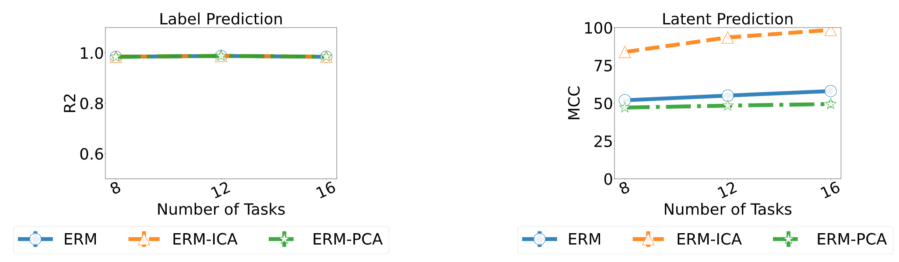

# Towards efficient representation identification in supervised learning
Code accompanying the paper [Towards efficient representation identification in supervised learning](https://openreview.net/forum?id=7UwoSnMDXWE) published in [CleaR 2022](https://www.cclear.cc/2022)

# Brief note about the paper

Humans have a remarkable ability to disentangle complex sensory inputs (e.g., image, text) into simple factors of variation (e.g., shape, color) without much supervision. This ability has inspired many works that attempt to solve the following question: how do we invert the data generation process to extract those factors with minimal or no supervision? Several works in the literature on non-linear independent component analysis have established this negative result; without some knowledge of the data generation process or appropriate inductive biases, it is impossible to perform this inversion. In recent years, a lot of progress has been made on disentanglement under structural assumptions, e.g., when we have access to auxiliary information that makes the factors of variation conditionally independent. However, existing work requires a lot of auxiliary information, e.g., in supervised classification, it prescribes that the number of label classes should be at least equal to the total dimension of all factors of variation. In this work, we depart from these assumptions and ask: a) How can we get disentanglement when the auxiliary information does not provide conditional independence over the factors of variation? b) Can we reduce the amount of auxiliary information required for disentanglement? For a class of models where auxiliary information does not ensure conditional independence, we show theoretically and experimentally that disentanglement (to a large extent) is possible even when the auxiliary information dimension is much less than the dimension of the true latent representation. 

# Reproducibility

Use the script "scripts/reproduce_results.sh" to reproduce the results in the paper.

## Example Usage

Generate data for the regression task with data dimension 16 and total numbers tasks from the list [8 12 16]

    python3 data/regression_data.py --data_dim 16 --num_tasks_list 8 12 16

Run the proposed ERM-ICA method to solve the regression task and identify the latent varibles.

    python3 scripts/vanilla_analysis.py --data_dir regression_num_layer_2_latent_uniform_discrete --data_dim 16 --num_tasks_list 8 12 16 --train_model 1

